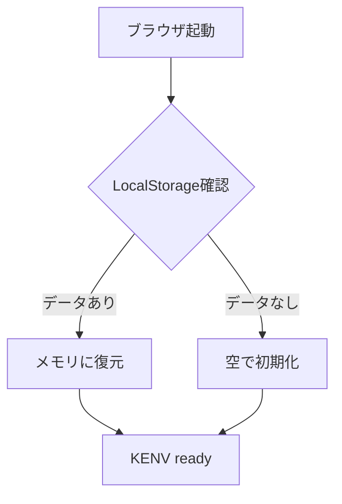
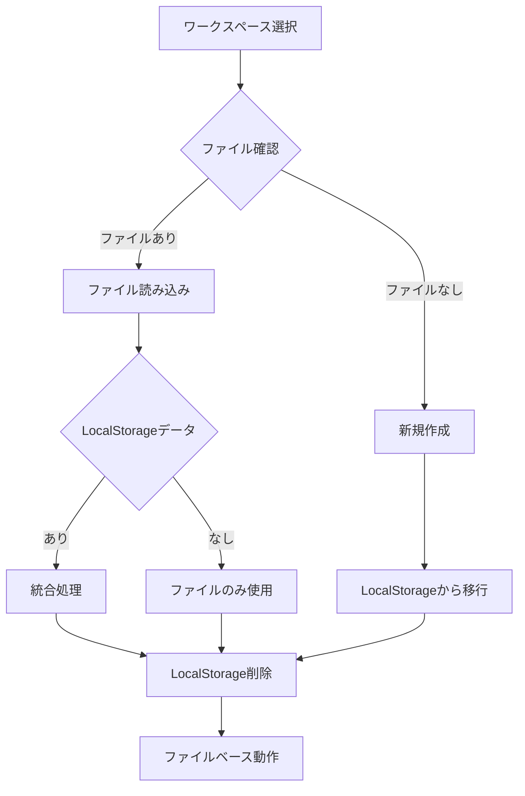

# KENV ハンドリングガイド v5.11.48

## 概要
KENV（Kaspa Environment）は、アップロードされたファイルとディレクトリのメタデータを管理するシステムです。ワークスペースの有無に関わらず動作し、シームレスなデータ管理を提供します。

## アーキテクチャ

### データ構造
```
KENVManager
├── entries[]        // エントリー配列（CSV形式で保存）
├── kindex          // インデックス（高速検索用）
│   ├── sortIndexes   // ソート用インデックス
│   ├── searchIndexes // 検索用インデックス
│   └── filterIndexes // フィルタ用インデックス
└── stats           // 統計情報
```

### ファイル構成
- `workspace.kenv` - メタデータ（JSON）
- `workspace.kindex` - インデックス（JSON）
- `workspace.kentry` - エントリー（CSV）

## データフロー

### 1. 起動時の動作


### 2. ワークスペース設定時


### 3. データ保存フロー
```mermaid
graph TD
    A[saveAll()] --> B{ワークスペース?}
    B -->|あり| C[ファイル保存]
    B -->|なし| D[容量チェック]
    D -->|5MB未満| E[LocalStorage保存]
    D -->|5MB以上| F[古いエントリー削除]
    F --> G[警告表示]
    G --> E
```

## 実装詳細

### 初期化処理
```javascript
async initialize() {
    log('[KENV] 初期化開始', 'info');
    
    try {
        // Step 1: LocalStorageから復元試行
        const tempData = SafeStorage.getItem('kenv_temp_data');
        if (tempData && this.validateKENVData(tempData)) {
            this.entries = tempData.entries || [];
            this.kindex = tempData.kindex || this.createEmptyIndex();
            log(`[KENV] LocalStorageから${this.entries.length}件復元`, 'info');
        }
        
        // Step 2: ワークスペース処理
        if (WorkspaceState.handle) {
            const fileLoaded = await this.loadAll();
            
            if (fileLoaded && tempData) {
                // 統合確認
                const shouldMerge = await this.confirmMerge(tempData);
                if (shouldMerge) {
                    await this.mergeTemporaryData(tempData);
                }
            }
            
            // LocalStorage削除
            SafeStorage.removeItem('kenv_temp_data');
        }
        
        this._initialized = true;
        return true;
        
    } catch (error) {
        log(`[KENV] 初期化エラー: ${error.message}`, 'error');
        // フォールバック：空で初期化
        this.entries = [];
        this.kindex = this.createEmptyIndex();
        this._initialized = true;
        return false;
    }
}
```

### エラーハンドリング

#### SafeStorageクラス
```javascript
class SafeStorage {
    static setItem(key, value) {
        try {
            localStorage.setItem(key, value);
            return { success: true };
        } catch (e) {
            if (e.name === 'QuotaExceededError') {
                this.handleQuotaExceeded(key);
                // リトライ
                try {
                    localStorage.setItem(key, value);
                    return { success: true };
                } catch (e2) {
                    return { success: false, error: 'quota_exceeded' };
                }
            }
            return { success: false, error: e.message };
        }
    }
    
    static getItem(key) {
        try {
            const value = localStorage.getItem(key);
            if (!value) return null;
            
            if (value.startsWith('{') || value.startsWith('[')) {
                try {
                    return JSON.parse(value);
                } catch (e) {
                    console.error(`Invalid JSON in ${key}:`, e);
                    localStorage.removeItem(key);
                    return null;
                }
            }
            return value;
        } catch (e) {
            console.error(`Storage access error:`, e);
            return null;
        }
    }
    
    static handleQuotaExceeded(newKey) {
        const priorityOrder = [
            'kaspa-upload-progress',
            'kaspa-upload-metadata',
            'kaspaDirectories',
            'kaspaDAG',
            'kenv_temp_data' // 最重要
        ];
        
        for (const key of priorityOrder) {
            if (key !== newKey && localStorage.getItem(key)) {
                localStorage.removeItem(key);
                log(`[Storage] 容量確保のため${key}を削除`, 'warning');
                break;
            }
        }
    }
}
```

### 容量管理
```javascript
const KENV_LOCALSTORAGE_LIMIT = 5 * 1024 * 1024; // 5MB
const MAX_ENTRIES_IN_LOCALSTORAGE = 500; // 最大500件

async saveToLocalStorage() {
    // Step 1: エントリー数チェック
    let entriesToSave = this.entries;
    if (entriesToSave.length > MAX_ENTRIES_IN_LOCALSTORAGE) {
        entriesToSave = this.entries.slice(-MAX_ENTRIES_IN_LOCALSTORAGE);
        this.showCapacityWarning('entry_count', this.entries.length, MAX_ENTRIES_IN_LOCALSTORAGE);
    }
    
    // Step 2: インデックス再構築
    const tempKindex = this.createEmptyIndex();
    entriesToSave.forEach((entry, index) => {
        this.updateIndexForEntry(entry, index, tempKindex);
    });
    
    // Step 3: サイズチェック
    const data = {
        entries: entriesToSave,
        kindex: tempKindex,
        version: '3.1.3',
        timestamp: new Date().toISOString()
    };
    
    const dataStr = JSON.stringify(data);
    if (dataStr.length > KENV_LOCALSTORAGE_LIMIT) {
        // さらに削減
        const reductionRatio = KENV_LOCALSTORAGE_LIMIT / dataStr.length;
        const targetCount = Math.floor(entriesToSave.length * reductionRatio * 0.8);
        entriesToSave = entriesToSave.slice(-targetCount);
        
        // 再度インデックス構築
        const finalKindex = this.createEmptyIndex();
        entriesToSave.forEach((entry, index) => {
            this.updateIndexForEntry(entry, index, finalKindex);
        });
        
        data.entries = entriesToSave;
        data.kindex = finalKindex;
        data.truncated = true;
        data.originalCount = this.entries.length;
        
        this.showCapacityWarning('size_limit', dataStr.length, KENV_LOCALSTORAGE_LIMIT);
    }
    
    // Step 4: 保存
    const result = SafeStorage.setItem('kenv_temp_data', JSON.stringify(data));
    if (!result.success) {
        log('[KENV] LocalStorage保存失敗', 'error');
        this.showWorkspaceRecommendation();
    }
}
```

### インデックス重複防止（v5.11.47修正）
```javascript
updateIndex(entry, lineNumber) {
    if (!entry || !entry.name) {
        log('[KENV] updateIndex: 無効なエントリー', 'error');
        return;
    }
    
    // 既存エントリーを削除（重複防止）
    this.removeFromIndex(lineNumber);
    
    // 新規追加
    this.addToIndex(entry, lineNumber);
    
    // 更新時刻
    this.kindex.updated = new Date().toISOString();
}

removeFromIndex(lineNumber) {
    // sortIndexes
    this.kindex.sortIndexes.name = this.kindex.sortIndexes.name.filter(
        ([name, lineNum, type]) => lineNum !== lineNumber
    );
    this.kindex.sortIndexes.size = this.kindex.sortIndexes.size.filter(
        ([size, lineNum]) => lineNum !== lineNumber
    );
    this.kindex.sortIndexes.uploadDate = this.kindex.sortIndexes.uploadDate.filter(
        ([timestamp, lineNum]) => lineNum !== lineNumber
    );
    
    // searchIndexes
    Object.keys(this.kindex.searchIndexes.name).forEach(prefix => {
        this.kindex.searchIndexes.name[prefix] = 
            this.kindex.searchIndexes.name[prefix].filter(
                lineNum => lineNum !== lineNumber
            );
    });
    
    // filterIndexes
    ['type', 'status'].forEach(category => {
        Object.keys(this.kindex.filterIndexes[category]).forEach(key => {
            this.kindex.filterIndexes[category][key] = 
                this.kindex.filterIndexes[category][key].filter(
                    lineNum => lineNum !== lineNumber
                );
        });
    });
}
```

### データ統合処理
```javascript
async confirmMerge(tempData) {
    const entryCount = tempData.entries?.length || 0;
    if (entryCount === 0) return false;
    
    return confirm(
        `ワークスペース外で作成された${entryCount}件のKENVデータが見つかりました。\n\n` +
        'このデータをワークスペースに統合しますか？\n\n' +
        '「OK」: 統合する（推奨）\n' +
        '「キャンセル」: 破棄する'
    );
}

async mergeTemporaryData(tempData) {
    const newEntries = tempData.entries || [];
    let mergedCount = 0;
    
    for (const entry of newEntries) {
        // ID重複チェック
        const exists = this.entries.some(e => e.id === entry.id);
        if (!exists) {
            this.entries.push(entry);
            const lineNumber = this.entries.length - 1;
            this.updateIndex(entry, lineNumber);
            mergedCount++;
        }
    }
    
    if (mergedCount > 0) {
        await this.saveAll();
        log(`[KENV] ${mergedCount}件のデータを統合しました`, 'success');
    }
}
```

### データ検証
```javascript
validateKENVData(data) {
    if (!data || typeof data !== 'object') return false;
    if (!Array.isArray(data.entries)) return false;
    if (!data.kindex || typeof data.kindex !== 'object') return false;
    
    // バージョンチェック
    if (data.version && !['3.1.3', '3.1.2', '3.1.1'].includes(data.version)) {
        log(`[KENV] 未対応バージョン: ${data.version}`, 'warning');
    }
    
    // インデックス整合性チェック
    const maxLineNumber = data.entries.length - 1;
    const indexTypes = ['name', 'size', 'uploadDate'];
    
    for (const type of indexTypes) {
        const index = data.kindex.sortIndexes?.[type];
        if (!index) continue;
        
        for (const item of index) {
            const lineNum = type === 'name' ? item[1] : item[1];
            if (lineNum > maxLineNumber) {
                log(`[KENV] インデックス不整合: ${type}`, 'error');
                return false;
            }
        }
    }
    
    return true;
}
```

## UI/UX

### 容量警告
```javascript
showCapacityWarning(type, current, limit) {
    const warningEl = document.getElementById('kenvCapacityWarning');
    if (!warningEl) return;
    
    const messages = {
        'entry_count': `エントリー数制限: ${current}件中${limit}件のみ保存`,
        'size_limit': `容量制限: ${(current/1024/1024).toFixed(1)}MB → ${(limit/1024/1024).toFixed(1)}MBに削減`
    };
    
    warningEl.innerHTML = `
        <div class="warning-box">
            <span class="warning-icon">⚠️</span>
            <span>${messages[type]}</span>
            <button onclick="WorkspaceHandlers.selectWorkspace()">
                作業フォルダ設定
            </button>
        </div>
    `;
    
    warningEl.style.display = 'block';
}
```

### ワークスペース推奨
```javascript
showWorkspaceRecommendation() {
    if (this._workspaceRecommendationShown) return;
    this._workspaceRecommendationShown = true;
    
    const recommendation = `
KENVデータ管理の推奨事項:

現在、LocalStorageで動作しています（容量制限: 5MB）
より安定した動作のため、作業フォルダの設定を推奨します。

【作業フォルダのメリット】
• 容量制限なし
• ブラウザを閉じてもデータ保持
• 複数ブラウザ間でデータ共有可能

設定は「ステータス」タブから行えます。
`;
    
    log(recommendation, 'info');
}
```

## データ移行

### エクスポート
```javascript
async exportKENV() {
    const exportData = {
        version: '3.1.3',
        exported: new Date().toISOString(),
        entries: this.entries,
        kindex: this.kindex,
        stats: this.calculateStats()
    };
    
    const blob = new Blob([JSON.stringify(exportData, null, 2)], {
        type: 'application/json'
    });
    
    const url = URL.createObjectURL(blob);
    const a = document.createElement('a');
    a.href = url;
    a.download = `kenv_export_${Date.now()}.json`;
    a.click();
    URL.revokeObjectURL(url);
    
    log('[KENV] データをエクスポートしました', 'success');
}
```

### インポート
```javascript
async importKENV(file) {
    try {
        const text = await file.text();
        const data = JSON.parse(text);
        
        if (!this.validateKENVData(data)) {
            throw new Error('無効なKENVデータ');
        }
        
        const importCount = await this.mergeImportedData(data);
        log(`[KENV] ${importCount}件のデータをインポートしました`, 'success');
        
    } catch (error) {
        log(`[KENV] インポートエラー: ${error.message}`, 'error');
    }
}
```

## ブラウザ互換性

### プライベートモード対応
```javascript
checkStorageAvailability() {
    try {
        const test = '__kenv_test__';
        localStorage.setItem(test, '1');
        localStorage.removeItem(test);
        return true;
    } catch (e) {
        log('[KENV] ストレージ使用不可 - メモリのみで動作', 'warning');
        this.useMemoryOnly = true;
        return false;
    }
}
```

### 定期的な整合性チェック
```javascript
startPeriodicValidation() {
    setInterval(() => {
        if (!WorkspaceState.handle && !this.useMemoryOnly) {
            const data = SafeStorage.getItem('kenv_temp_data');
            if (data && !this.validateKENVData(data)) {
                log('[KENV] データ破損を検出 - 再初期化', 'error');
                this.entries = [];
                this.kindex = this.createEmptyIndex();
                SafeStorage.removeItem('kenv_temp_data');
            }
        }
    }, 60000); // 1分ごと
}
```

## ベストプラクティス

1. **常に初期化を実行** - ワークスペースの有無に関わらず
2. **エラーハンドリング** - すべてのストレージ操作でtry-catch
3. **容量管理** - 5MB制限を意識した設計
4. **データ検証** - 読み込み時は必ず検証
5. **ユーザー通知** - 重要な操作は必ず通知
6. **段階的な機能提供** - メモリ → LocalStorage → ファイル

## まとめ

KENVシステムは、ワークスペースの有無に関わらず柔軟に動作し、ユーザーに透明性の高いデータ管理を提供します。エラーハンドリングと容量管理により、安定した動作を保証し、データ移行機能により、異なる環境間でのデータ共有も可能です。